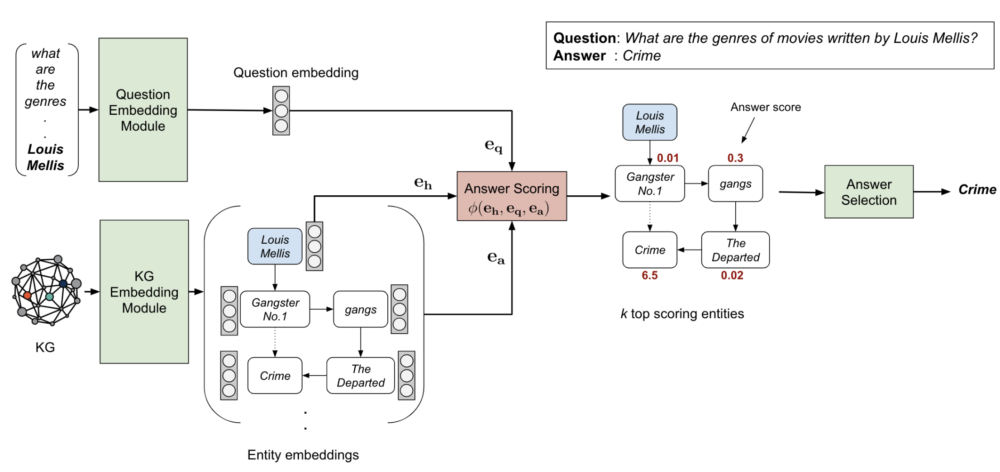

# EmbedKGQA
This is the code for our ACL 2020 paper [Improving Multi-hop Question Answering over Knowledge Graphs using Knowledge Base Embeddings](https://malllabiisc.github.io/publications/papers/final_embedkgqa.pdf)

We will be updating the README with instructions on how to download the dataset and run the code.


# Instructions

In order to run the code for MetaQA, first download data.zip and pretrained_model.zip from [here](https://drive.google.com/drive/folders/1RlqGBMo45lTmWz9MUPTq-0KcjSd3ujxc?usp=sharing). Unzip these files in the main directory.

Then change to directory ./KGQA/LSTM. Following is an example command to run the QA training code

```
python3 main.py --mode train --relation_dim 200 --hidden_dim 256 \
--gpu 2 --freeze 0 --batch_size 128 --validate_every 5 --hops 2 --lr 0.0005 --entdrop 0.1 --reldrop 0.2  --scoredrop 0.2 \
--decay 1.0 --model ComplEx --patience 5 --ls 0.0 --kg_type half
```
